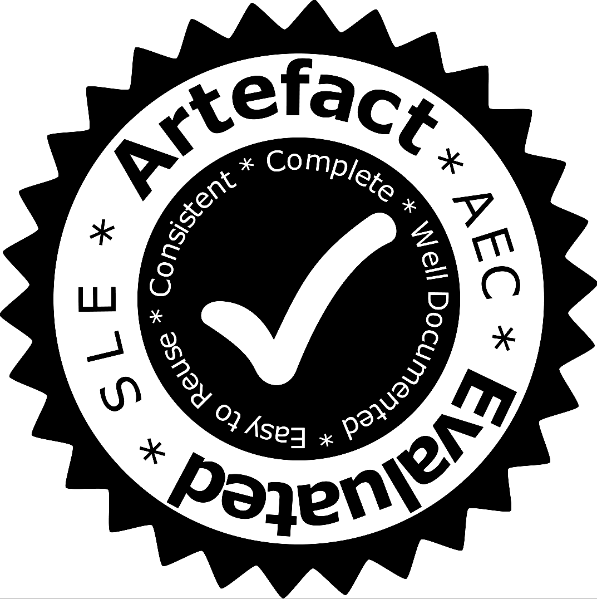

# SLE 2016 Artefacts Track

- All artefacts are subject to their corresponding licenses.
- All reviews are open with attribution to their authors ([CC-BY](https://creativecommons.org/licenses/by/4.0/)).
- All final decisions are public domain.
- All software for managing that process (GitHub) is open source and readily usable. 

______
For any questions concerning this process, please contact [the artefact evaluation chairs](mailto:sle16aec@gmail.com) **@[grammarware](https://github.com/grammarware)** and **@[kolovos](https://github.com/kolovos)**.

